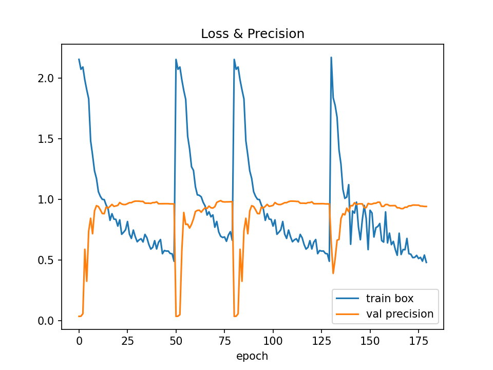
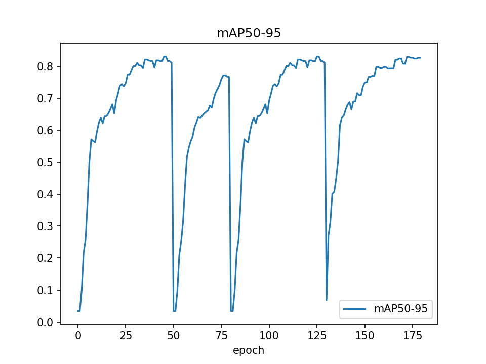
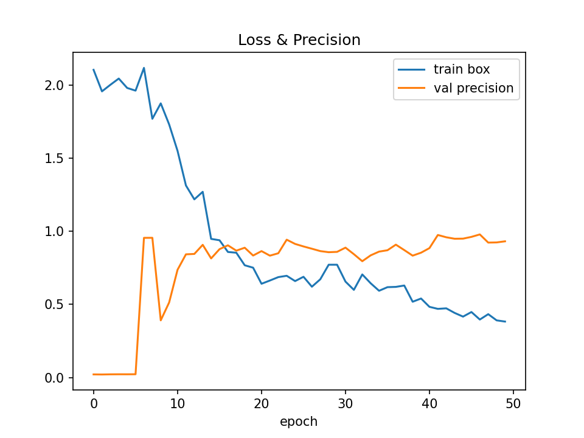
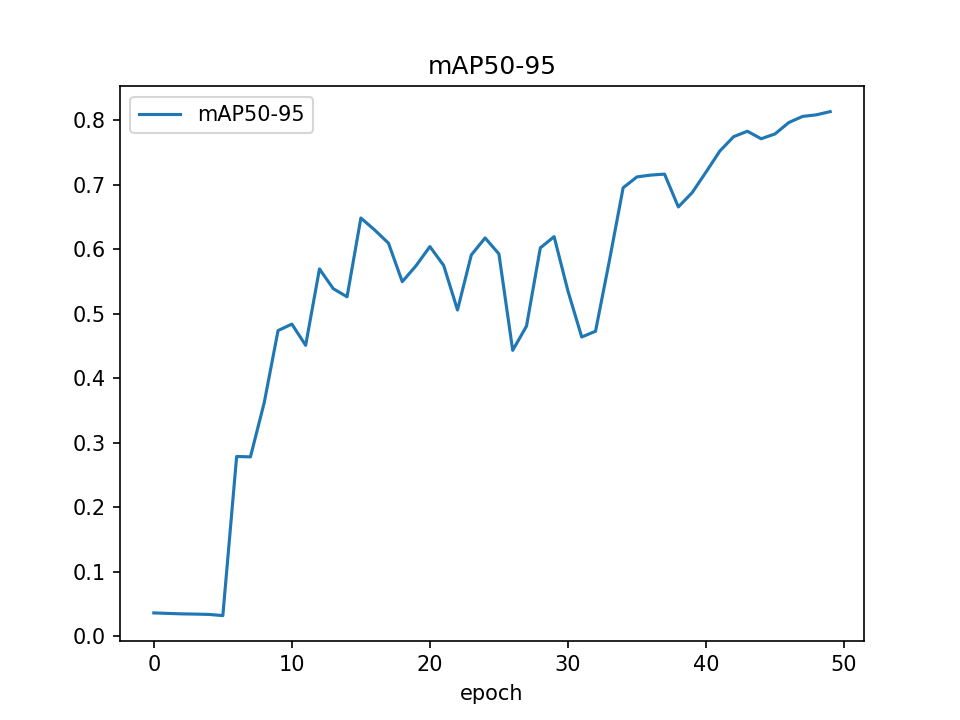
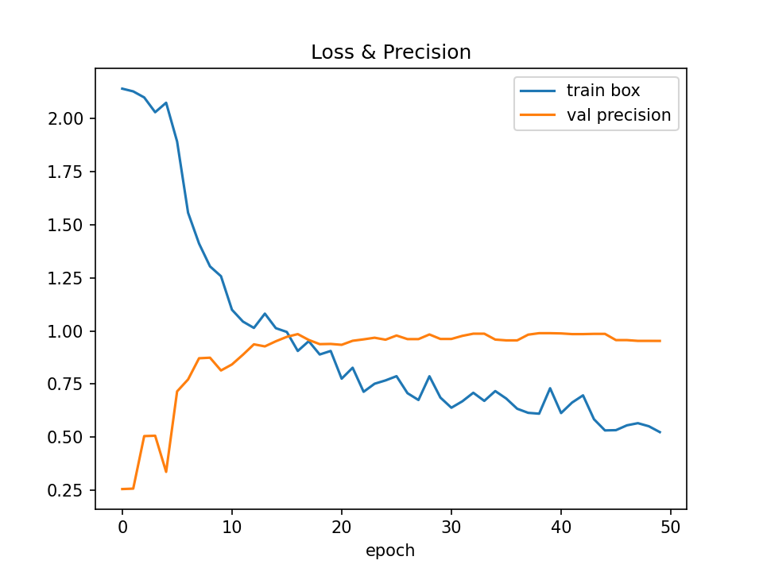
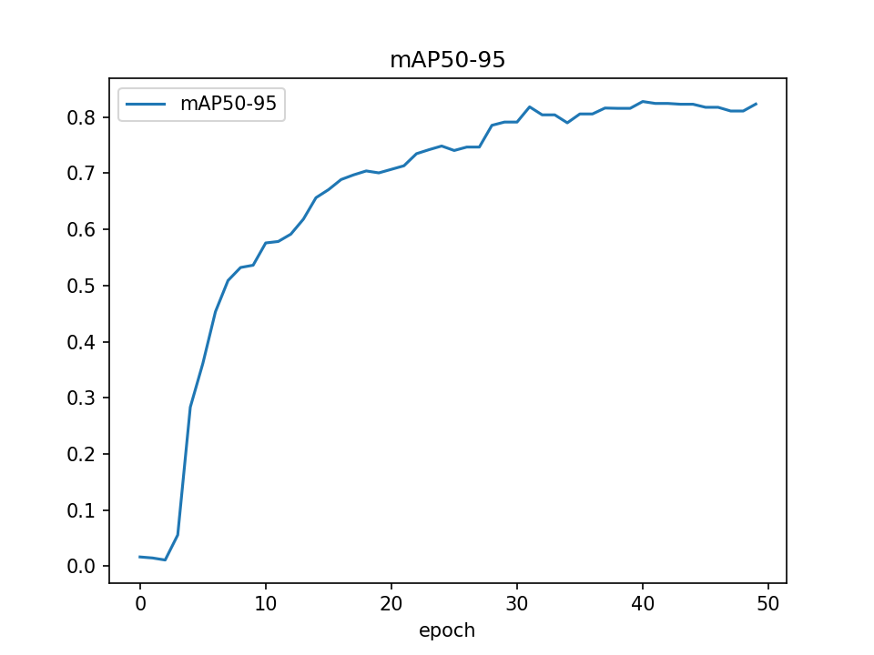

# Итоговый отчёт

## Модель **s**  (exp11_s)

- **mAP50**: 0.9498
- **mAP50-95**: 0.8271
- **precision**: 0.943
- **recall**: 0.9444
- **epochs**: 180

## Модель **x**  (exp11_x)

- **mAP50**: 0.9213
- **mAP50-95**: 0.8136
- **precision**: 0.9323
- **recall**: 0.8701
- **epochs**: 50

## Модель **s**  (exp_s)

- **mAP50**: 0.9817
- **mAP50-95**: 0.8233
- **precision**: 0.9528
- **recall**: 0.9328
- **epochs**: 50

